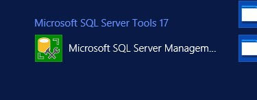

# How to connect to Legacy server

Requires connection from Windows 10/11 (known compatible versions with RDP)

## Steps \ Checklist for connection

> :

- Open Remote Desktop Protocol from Windows Apps (search OS for RDP)

  - **Computer:**`chemweb-prod.asurite.ad.asu.edu`  
  - **User name:**`ASURITE\ex_jmclain3`  

   

- Enter Gateway Settings
  - click 'Show Options'
  - click 'Advanced'

   
   

- **_connection settings:_**
- **Use these RD Gateway server settings**
  - **server name:** `dept-ts.asu.edu` 
  - **logon method:** `Allow me to select later`
  - [x] Bypass RD Gateway server for local addresses

- Confirm settings and Click "Connect"

- wait for the connection to be established and should automatically open tunnel to remote desktop with the login screen

> :envelope: Check inbox for credentials

### Successful login

You will be in a Window Server 2018 OS with IIS installed. You can navigate GUI to Legacy Applications source code and SQL Server database.

> :warning: **This is a live production server** :warning:  

Webapp root directory: `C:\chem-webtools` with static content as URL paths 

**Example**

`C:\chem-webtools\webtools\index.asp`  
is accessible at  
`https://chem-webtools.asu.edu/webtools/index.asp`

File Tree

[link](./assets/tree-ex.txt)

## Database

Access is available as readonlu from with in the RDP environment. Production DB is hosted by ASU and is a Microsoft SQL (MSSQL) dialect.

To gain readonly access open Microsoft SQL Server Management Tools 2017 by selecting the app from the Windows OS start menu.

It should automaticly connect to the database. If it doesn't you'll need the following information to connect.

Database addresses: 

1. `dept-sql17-n2.asurite.ad.asu.edu\dept_chem17,51437`  on Chemdept database
2. `dept-sql17-n1.asurite.ad.asu.edu\dept_chem17,51437` on Chembus database

You should only ever need the first one, Chembus is still accessible on Chemdept.

The username and password are the same as used to log into the RDP and the SQL software will get them automaticily from the current logged in user.

the data table are heavy and intimindating, making sense of the chaos can be challenging. In addition to the table, the is the views. It seems over the years of other developers instead of creating relationsships in the tables, someone or many used view to join data to be queried and rendered in the legacy app. For Chemdept there is over 300 tables present but only a hand full of them will be the focal point when upload new students. Another thing to be mindful of is the column labels and name casing is inconsistant across the entire DB. For example in the same upload to 3 tables you have an employee id colum, but each table will be mapped differently. `emp_id` , `EmplID` and `EMPID` will be worked with in a single query if hitting multiple tables.

i grabbed lists of the table and views for the databases, they are in tab separated format

[chemdept tables](./assets/Chemdept-tables-list-07092024.txt)

[chemdept views](./assets/chemdept-views-list_07092024.txt)

[chembus tables](./assets/chembus-table-list_07092024.txt)

[chembus views](./assets/chembus-views-list_07092024.txt)

[applicants tables](./assets//applicants-tables-list_07092024.txt)