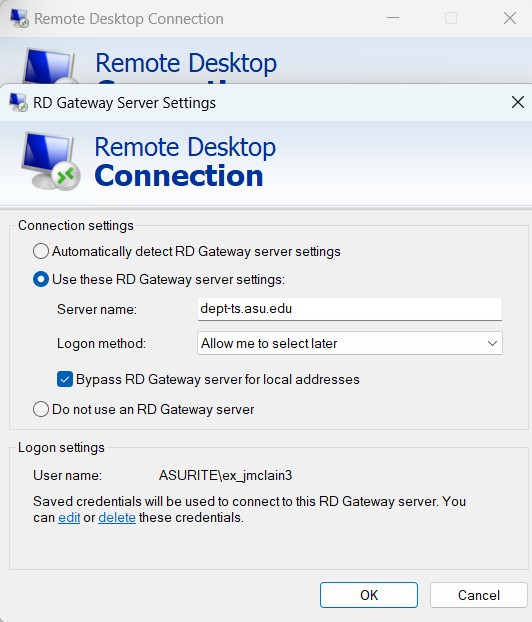

# How to connect to Legacy server

Requires connection from Windows 10/11 (known compatible versions with RDP)

## Steps \ Checklist for connection

> :

- Open Remote Desktop Protocol from Windows Apps (search OS for RDP)

  - **Computer:**`chemweb-prod.asurite.ad.asu.edu`  
  - **User name:**`ASURITE\ex_jmclain3`  

   

- Enter Gateway Settings
  - click 'Show Options'
  - click 'Advanced'

   
   

- **_connection settings:_**
- **Use these RD Gateway server settings**
  - **server name:** `dept-ts.asu.edu` 
  - **logon method:** `All me to select later`
  - [x] Bypass RD Gateway server for local addresses

- Confirm settings and Click "Connect"

- wait for the connection to be established and should automatically open tunnel to remote desktop with the login screen

> :envelope: Check inbox for credentials

### Successful login

You will be in a Window Server 2018 OS with IIS installed. You can navigate GUI to Legacy Applications source code and SQL Server database.

> :warning: **This is a live production server** :warning:  

Webapp root directory: `C:\chem-webtools` with static content as URL paths 

**Example**

`C:\chem-webtools\webtools\index.asp`  
is accessible at  
`https://chem-webtools.asu.edu/webtools/index.asp`

File Tree

[link](./assets/tree-ex.txt)

<!-- dept-sql17-n2.asurite.ad.asu.edu\dept_chem17,51437 and dept-sql17-n1.asurite.ad.asu.edu\dept_chem17,51437 on Chembus database -->